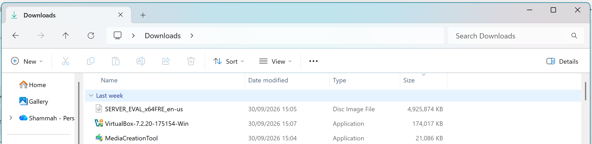
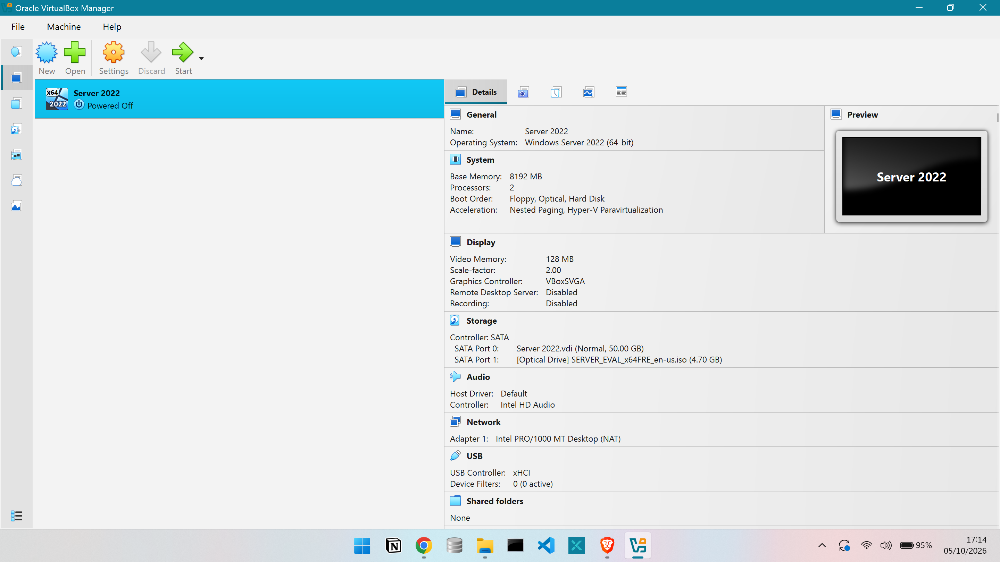
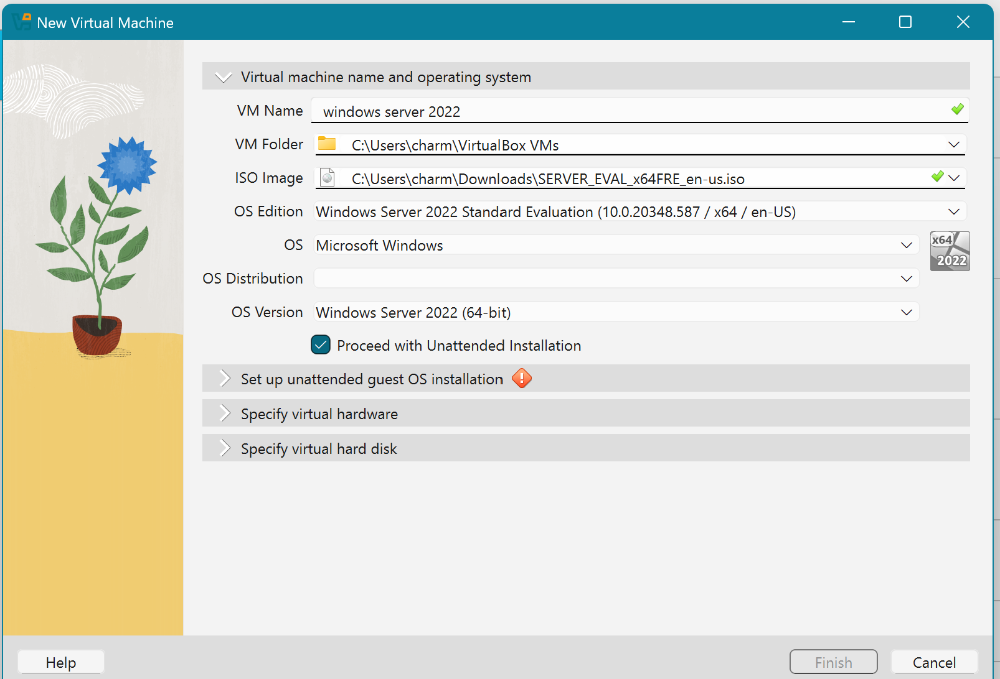
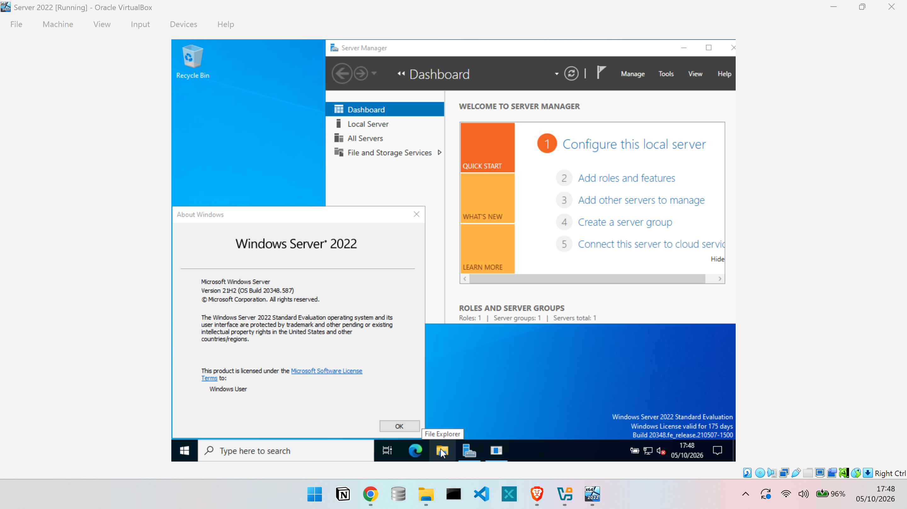
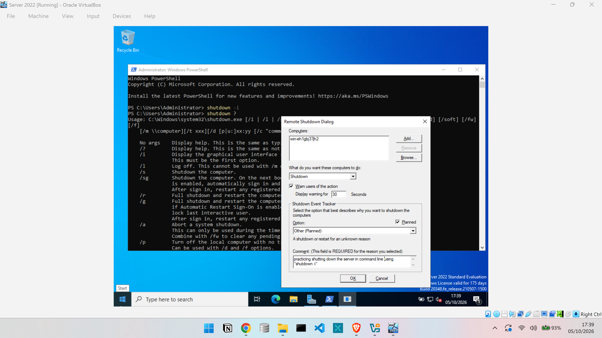
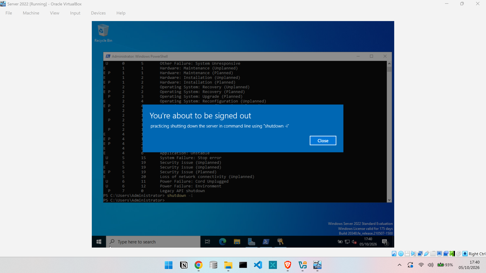

# Windows-Server-2022-ActiveDirectory-Lab
Hands-on Enterprise IT Helpdesk Lab built with Oracle VirtualBox, Windows Server 2022, Active Directory Domain Services, and Windows 11. Demonstrates 1st Line Service Desk ticket troubleshooting, user onboarding, and GPO administration.

## 📋 Table of Contents
* [Overview & Prerequisites](#overview--prerequisites)
* [Part 1: Environment & Windows Server 2022 Installation](#part-1-environment--windows-server-2022-installation)
* [Part 2: Active Directory & Domain Controller Setup (Upcoming)](#part-2-upcoming)

---

## 📌 Overview & Prerequisites
This project documents a hands-on IT Helpdesk practice lab modeled after enterprise infrastructure. It demonstrates foundational 1st Line Service Desk capabilities—including OS deployment, Active Directory administration, user onboarding, and endpoint troubleshooting.

### Core Technologies
* **Hypervisor:** Oracle VirtualBox (v7.1.4) 
* **Server OS:** Windows Server 2022 (64-bit ISO)
* **Client OS:** Windows 11 Enterprise (ISO via Media Creation Tool)

---

<b>🛠️ Part 1: Environment & Windows Server 2022 Installation (Click to Expand)</b>

 

### 1. Software Downloads
1. Downloaded and installed **Oracle VirtualBox 7.1.4**.
2. Acquired the **Windows Server 2022 64-bit ISO** evaluation file from Microsoft.
3. Generated the **Windows 11 ISO** using the Windows 11 Media Creation Tool (`Create ISO file` option).

---

### 2. Virtual Machine Allocation
1. Opened VirtualBox Manager and selected **New**.
2. Configured VM properties:
   * **Name:** `Server 2022` 
   * **OS Type:** `Windows 2022` 
3. Allocated virtual hardware resources:
   * **Base Memory (RAM):** 8192 MB (8 GB)
   * **Processors:** 2 vCPUs 
   * **Storage:** Created standard virtual disk image

---

### 3. Windows Server 2022 OS Deployment
1. Attached the **Windows Server 2022 ISO** image to the VM optical drive.
2. Booted the VM and selected **Windows Server 2022 Datacenter (Desktop Experience)** to enable the graphical user interface (GUI).
3. Performed custom installation and allowed the OS installer to copy files and finish updates.
4. Following the system reboot, removed/unmounted the ISO installation disk from the virtual drive.

---

### 4. Post-Installation Configuration & Verification
1. Configured the primary local **Administrator account password** and signed in via `Ctrl + Alt + Delete`.
2. Opened **Server Manager** and updated the system **Time Zone** from Pacific Time to local Eastern Time.
3. Adjusted VirtualBox display scaling under `Virtual Screen 1 -> 125%` for optimal screen visibility.
4. Tested administrative Command Prompt CLI utilities for remote system management:
   * `shutdown /i` — Opened the Graphical Remote Shutdown interface
   * `shutdown /s` — Standard full system shutdown
   * `shutdown /r` — Full system reboot
   * `shutdown /?` — Displayed full command parameter list

---

<b>🎯 Part 2: (Upcoming)</b>

 

* Upcoming

